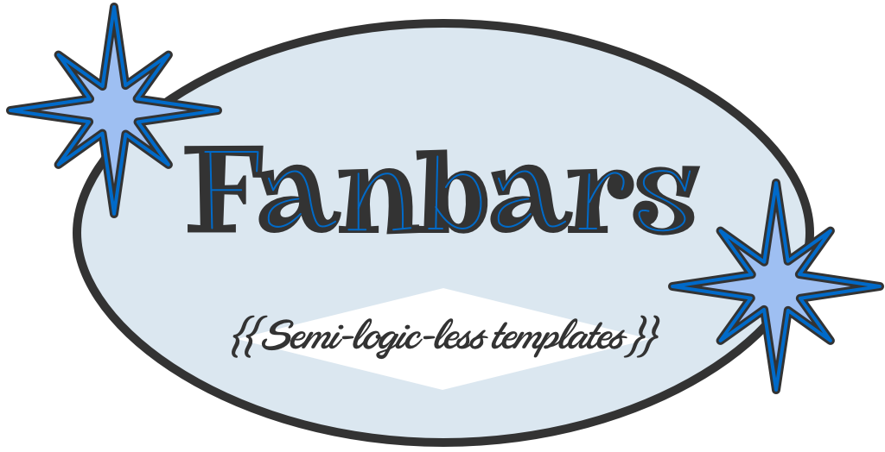

<p align="center">
  
</p>

# Fanbars

"Semi" logic-less templates for [Fantom](https://fantom.org) inspired by
[Mustache](http://mustache.github.io).

Fanbars can be used for HTML, config files, source code - anything. It works
by expanding tags in a template using values provided in a `Map`.

    {{#if isLoggedIn}}
      Hello, {{username}}!
      <ul>
      {{#each item in cart}}
        <li>{{item.name}} ${{item.price}}</li>
      {{/each}}
      </ul>
    {{/if}}

We call it "semi" logic-less because there are some basic control structures
for `if/else` and `each` blocks.  Technically Mustache has these as well, but
its a bit opaque (and confusing) how they get exposed.  So Fanbars goes ahead
and makes them explicit.  This seemed like a good middle ground for what you
need in real projects without adding any "real" logic to templates.

## Installation

Install into your current Fantom repo using `fanr` -- full API docs over on
[Eggbox](http://eggbox.fantomfactory.org/pods/fanbars):

    $ fanr install fanbars

## Usage

Render text by compiling your template then renderering:

```fantom
Fanbars.compile(template).render(out, map)
```

The input template can be an `InStream`, `Str` or `File` instance:

```fantom
Fanbars.compile(in)
Fanbars.compile(file)
Fanbars.compile("Hello {{name}}!")
```

Output can be streamed to an `OutStream` instance, or return a fully rendered
`Str`:

```fantom
f := Fanbars.compile(template)
s := f.renderStr(map)  // return as Str
f.render(out, map)     // stream to out
```

## Syntax

Variable substitution uses the `{{var}}` syntax:

    template:
      Hello {{name}}!

    map:
      ["name":"Bob"]

    output:
      Hello Bob!

By default all variable text is HTML escaped using
[`OutStream.writeXml`](https://fantom.org/doc/sys/OutStream#writeXml).  To
replace text unescaped use the "triple-stash" `{{{`:

    template:
      This is {{foo}} and this is {{{foo}}}

    map:
      ["foo":"A&W"]

    output:
      This is A&amp;W and this is A&W

If blocks use the `{{#if var}}` syntax, where the value of `var` is considered
`false` if its `null` or `false`, everything else is `true`:

    template:
      {{#if isLoggedIn}}
        Hello {{name}}!
      {{/if}}

    map:
      ["isLoggedIn":true, "name":"Bob"]

    output:
      Hello Bob!

Each blocks use the `{{#each v in var}}` syntax, where the value of `v` is
replaced with each element in `var`:

    template:
      {{#each v in items}}
        Item #{{v}}
      {{/if}}

    map:
      ["items":[1,2,3]]

    output:
      Item #1
      Item #2
      Item #3